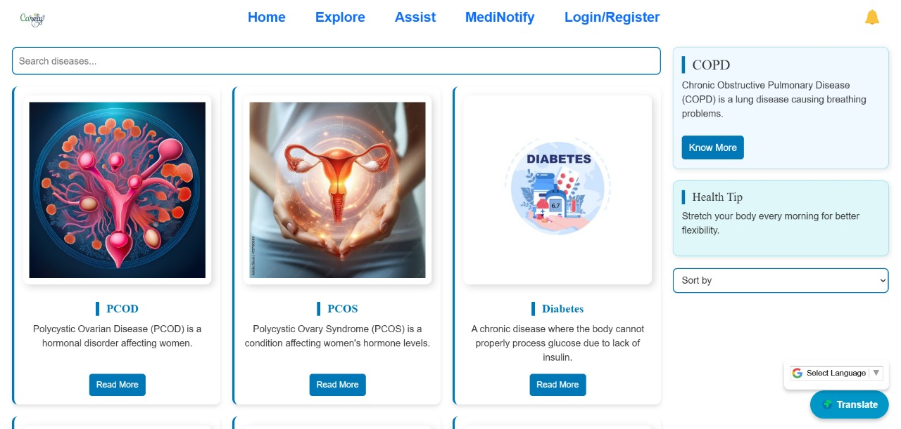
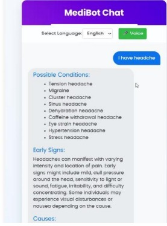
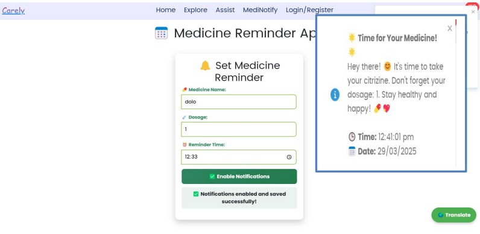

# Carely — Your Digital Healthcare Assistant

Carely is a full-stack web application designed to simplify medical assistance and healthcare access for users. With features like disease exploration, an intelligent medical chatbot, and personalized medicine reminders, Carely empowers individuals to manage their health proactively and efficiently.

---

## Why Carely?

Millions of people struggle with healthcare access, medical awareness, and medication adherence. Carely was built with a mission to bridge these gaps and offer:

- Accessible medical information  
- AI-powered support  
- Reminder-based medication management  
- User-centric health engagement

---

## Features

### Explore
Learn about diseases, symptoms, causes, treatments, and preventive measures. The content is organized for easy navigation and is accessible anytime.

### MediBot
An AI-powered chatbot that answers disease-related questions and helps users understand medical terms, symptoms, and suggestions.

### MediNotify
A personalized medicine notification system that allows users to:
- Schedule reminders by date, time, and dosage  
- Receive push notifications via Firebase Cloud Messaging  
- Never miss a medication again

### Scalable & Responsive (PWA)
Carely is built as a Progressive Web App (PWA), allowing users to install it on their devices and access it offline, offering a mobile-first, app-like experience.

---

## Screenshots

| Explore Page | MediBot | MediNotify |
|--------------|---------|------------|
|  |  |  |

---

## Technologies Used

- Frontend:
  - React.js  
  - HTML5, CSS3, JavaScript  
  - React Router

- Backend:
  - Node.js  
  - Express.js

- Database:
  - MongoDB

- Cloud & Messaging:
  - Firebase Cloud Messaging (FCM)

- Other Tools:
  - Git & GitHub for version control  
  - Netlify for frontend hosting  
  - Vercel/Postman for API testing

---

## Collaboration

### Team Members:
- [Appana Harini](https://github.com/APPANAHARINI1234) — MediNotify Integration, Project Leader  
- [Thanusri Burra](https://github.com/Thanusri-burra) — MediBot Integration & UI/UX Design  
- [Eda Lahari](https://github.com/eda-lahari) — Explore Section & UI/UX Design  
- [Ch Harshitha](https://github.com/chundurukesavaharshitha) — Translation Integration, UI/UX Design

---

## Installation

To run the project locally:

```bash
# Clone the repository
git clone https://github.com/APPANAHARINI1234/Carely.git

# Navigate to the project directory
cd Carely

# Install dependencies
npm install

# Start the development server
npm start
